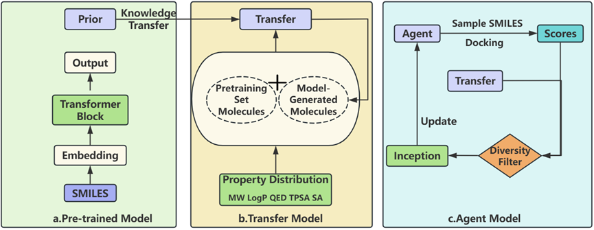

# Multi-Stage Conditional Molecular Generation with GPT:Integrating Active Fine-Tuning and Reinforcement Learning for Drug Discovery

---
This repository contains the implementation of the Conditional 
Molecular Generation (MCMG) approach, based on the research for 
conditional molecular generation using a combination of pretraining, 
active learning, and reinforcement learning techniques.

## Overview
This study introduces a multi-stage conditional molecular generation model (MCMG) 
based on the GPT architecture , using the mean and standard deviation of MW, 
LogP, QED, TPSA, and SA as generation conditions, designed to generate novel 
molecules with predefined chemical properties. The model employs a three-stage 
training process, consisting of large-scale pre-training on SMILES data, active 
fine-tuning with dual data sources, and reinforcement learning (RL) for optimization. 
The pre-training phase captures molecular structure and property distributions, while 
active fine-tuning directs the model toward target chemical spaces. RL is incorporated 
to enhance molecular docking scores and explore diverse chemical spaces. Experimental 
results demonstrate that the model not only generates molecules with the target 
properties but also achieves optimized docking scores, scaffold diversity, and 
synthetic accessibility. Notably, the model successfully achieves scaffold hopping, 
generating novel structures distinct from known bioactive compounds, offering valuable 
opportunities in drug discovery. Additionally, ADMET properties show that the generated
molecules meet key pharmacokinetic and toxicity criteria, supporting their potential 
as drug candidates. Our framework advances molecular generation by synergizing 
structural priors, active learning, and reinforcement learning, offering a scalable 
solution for drug discovery workflows requiring balanced innovation and practicality.


---
MCMG is a framework for generating molecules with specific desired properties using a three-stage approach:
1. **Pretraining** - Initial training of the molecular generation model on a large dataset
2. **Active Learning** - Fine-tuning the model with targeted molecular properties
3. **Reinforcement Learning** - Optimizing the model for specific molecular characteristics


## Directory Structure

```
.
├── MCMG/
│   ├── Configuration.py
│   ├── Dataset.py
│   ├── Generation.py
│   ├── InitializeWorkspace.py
│   ├── Model.py
│   └── Training.py
├── Utils.py
├── 1.Pretraining.py
├── 2.ActiveLearning.py
├── 3.Reinforcement_Learning.py
└── README.md
```

## Installation
Clone the repository:
```bash
git clone https://github.com/your-username/MCMG.git
cd MCMG
```

Note: You will need to have RDKit installed. For installation instructions, please refer to the [RDKit documentation](https://www.rdkit.org/docs/Install.html).

## Usage

The MCMG framework consists of three stages that should be run in sequence:

### 1. Pretraining Stage

Run the pretraining script to initialize the model:

```bash
python 1.Pretraining.py
```

### 2. Active Learning Stage

Run the active learning script with optional command-line arguments to specify input and output files:

```bash
python 2.ActiveLearning.py --fine_tune_dataset "path/to/input.csv" --output_file "path/to/output.csv"
```

You may also need to modify the `target_properties` variable in the script to specify the desired molecular properties for filtering.

### 3. Reinforcement Learning Stage

Run the reinforcement learning script with paths to the required model weights:

```bash
python 3.Reinforcement_Learning.py --agent_model_path "path/to/agent_model.pt" --prior_model_path "path/to/prior_model.pt"
```


## License
This work is licensed under a <a rel="license" href="http://creativecommons.org/licenses/by-nc-sa/4.0/">Creative Commons Attribution-NonCommercial-ShareAlike 4.0 International License</a>.

For commercial use, please contact [limin@csu.edu.cn](mailto:limin@csu.edu.cn).